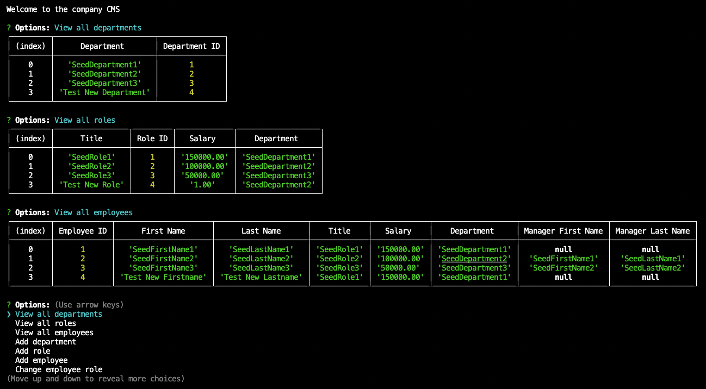

# Employee Tracker CMS

## Description

A small demo CMS (content management system) for tracking company department, role, and employee information with a simple terminal interface. View information on the company, add new elements, and change  information as desired.

## Table of Contents

- [Installation](#installation)
- [Usage](#usage)
- [Tests](#tests)
- [Contributing](#contributing)
- [Questions](#questions)
- [License](#license)

## Installation

Install and setup mysql locally. Run "npm i" in the repo directory. Modify .env.EXAMPLE to remove the dummy suffix and add your db credentials.

For demonstration purposes also load the schema and seed (in the 'db' directory).

## Usage

Run "node index" in the repo directory. Follow text prompts.

Youtube usage video: https://youtu.be/zOWTIyH_mqw

## Tests

No tests implemented at this time.

## Contributing

Not accepting contributions at this time, but feel free to fork and modify freely.

## Questions

[Github: Gordon-Magill](https://github.com/Gordon-Magill) 
Email: gordon.magill@gmail.com
Please reach out via provided email for any questions.

## License

Licensed under [Do What the Fuck You Want to Public License](http://www.wtfpl.net/about/).